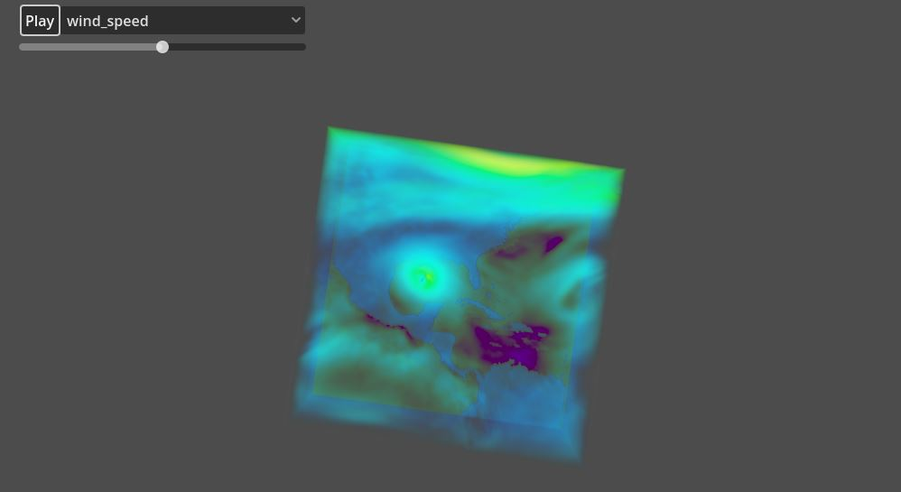
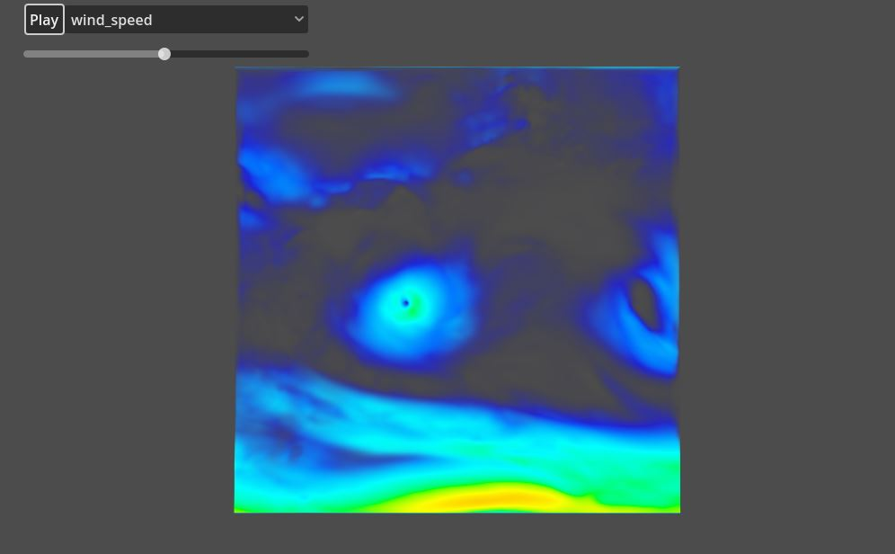
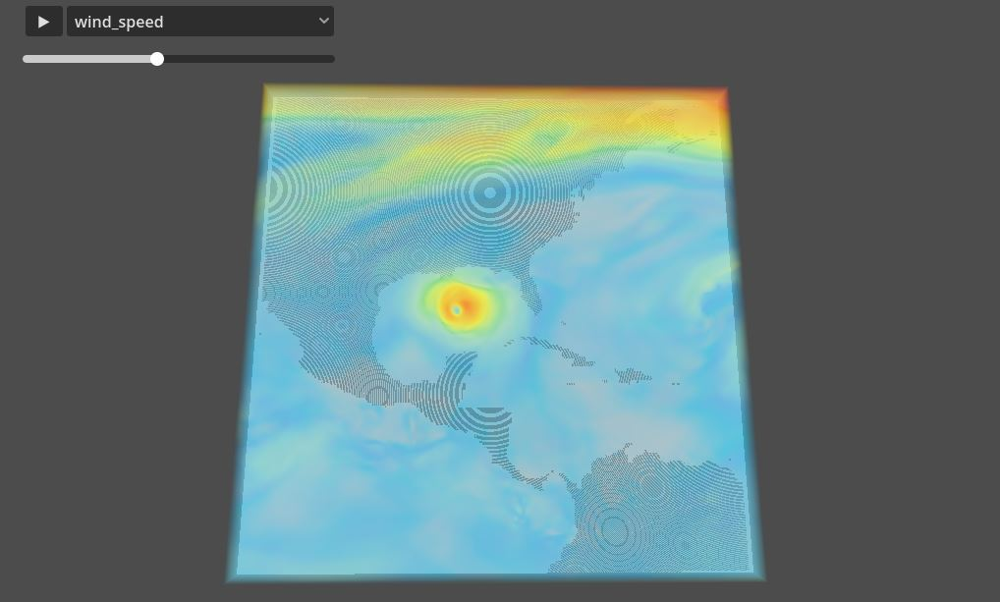

# 3D-Visualization-Pipeline---API-to-Godot
These coupled scripts allows users to fetch data directly from the CDS API (Copernicus Data Store), interpolate the 6-hour intervals into hourly data, and transform the same files to binary files, ingestible by Godot, a game development software.

